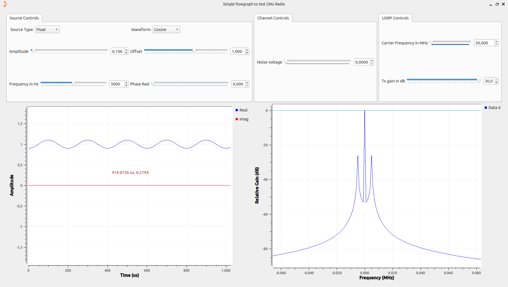

# Laboratorio de Comunicaciones
## Universidad Industrial de Santander


# Práctica 1: GNURADIO para el procesamiento de señales - Mediciones de potencia y frecuencia

### Integrantes
- **DUBAN YESID CORTÉS TABARES** - 2214644
- **Elkin** - Código

Escuela de Ingenierías Eléctrica, Electrónica y de Telecomunicaciones  
Universidad Industrial de Santander

### Fecha
4 de marzo de 2025

---

## Declaración de Originalidad y Responsabilidad
Los autores de este informe certifican que el contenido aquí presentado es original y ha sido elaborado de manera independiente. Se han utilizado fuentes externas únicamente como referencia y han sido debidamente citadas.

Asimismo, los autores asumen plena responsabilidad por la información contenida en este documento. 

Uso de IA: [Indicar si se usó IA y para qué aspectos específicos, por ejemplo: "Se utilizó ChatGPT para reformular secciones del texto y verificar gramática, pero el contenido técnico fue desarrollado íntegramente por los autores."]

---
## Contenido

### Resumen
En esta práctica, se realizaron mediciones de potencia y frecuencia utilizando herramientas de radio definido por software (SDR) y equipos de laboratorio como el USRP 2920, el osciloscopio R&S RTB2004 y el analizador de espectros R&S FPC1000.

Se comenzó con la revisión de especificaciones y configuración de los equipos. Luego, se generaron y analizaron señales en GNU Radio para comprender su comportamiento en los dominios del tiempo y la frecuencia. Posteriormente, se transmitieron señales con el USRP 2920 y se midieron parámetros clave como potencia, ancho de banda y relación señal a ruido (SNR) utilizando el analizador de espectros y el osciloscopio.

Finalmente, se compararon los resultados obtenidos en simulación y experimentación, evaluando la influencia del ruido y la configuración de los equipos en la calidad de la señal, además de analizar los cambios observados en las señales de tiempo - frecuencia al variar sus parámetros en cada una.

**Palabras clave:** Frecuencia, potencia, ruido, atenuación, calidad de la señal

### Introducción

El procesamiento de señales en el ambito de las telecomunicaciones es una pieza clave en los sistemas de comunicación modernos, en dónde la correcta selección de la frecuencia de muestreo y el uso correcto de herramientas (En este caso GNURadio) puede marcar la diferencia entre una señal legible y una completamente distorionada. En esta práctica se experimentará con estos conceptos. A través de la simulación y medición de señales se logrará entender el impacto del límite de Nyquist. 

En un laboratorio de comunicaciones, herramientas como GNU Radio ofrecen un entorno flexible para experimentar con señales en tiempo real. Sin embargo, ¿cuáles son sus principales ventajas en comparación con otros sistemas? ¿Qué ocurre cuando se asigna una frecuencia de muestreo inadecuada? Estas cuestiones serán abordadas a lo largo de la práctica, permitiendo una comprensión más profunda del muestreo y su papel en la transmisión y procesamiento de señales digitales.


### Procedimiento

## Actividad 1: Revisión de Especificaciones de los Equipos

#### USRP -2920 
Es un transceptor de RF ajustable con un convertidor analogico-digital de alta 
velocidad y un convertidor digital-analogico para la transmision de señales de 
banda base. TIene aplicaciones en emisión FM, seguridad pública, entre otras. 

Especificaciones: 
Rango de frecuencias (Transmisor y receptor): 50MHz to 2.2GHZ

Máxima potencia de salida:  

50mW to 100mW (17dBm to 20 dBm) entre 50MHz y 1.2GHZ. 

30mW to 70mW (15dBm to 18 dBm) entre 1.2GHz y 2.2GHZ. 

Rango de ganancia: 0dB to 31dB 

Frecuencia de paso: <1kHz 

Potencia: DE 12 a 15W (Máximo 18W)

#### Osciloscopio R&S RTB2004 

Dispositivo de medición de alta calidad diseñado para ofrecer precisión, 
visualización y herramientas de control para el manejo de señales electrónicas. 

Especificaciones: 

Ancho de banda: 70MHz to 300MHz 

Número de canales: 4 

Freq. Muestreo:  1.25GSa/s por canal y 2X2.5 GSa/s intercalado (Usando dos 
canales) 

Profundidad de memoria: 10Mpts por canal y 2x20Mpts intercalado. 

Rango de voltaje: El RTB2004 tiene un rango de entrada típico de ±50 V (en modo 
diferencial). 

#### Analizador de Espectros R&S FPC1000: 

Herramienta utilizada para el análisis y localización de fuentes de perturbaciones durante 
el desarrollo y tratamiento de señales. Permite visualizar en una pantalla las componentes 
espectrales pudiendo ser ésta cualquier tipo de ondas eléctricas, acústicas u ópticas. 

Especificaciones: 

Rango de frecuencias: 5kHz a 1GHz 

Nivel de ruido promedio visualizado: ± 1,5 % de escala completa 

Incertidumbre absoluta de frecuencia (De 20° a 30°c): <0.3dB 

Incertidumbre de respuesta en frecuencia (de +20°C a +30°C): <1dB 

Ancho de banda de resolución de hasta 1Hz

#### Medición de piso de ruido normalizado:

## Actividad 2: Simulación de Señales en GNU Radio


## **Objetivo**  
Generar y analizar señales en GNU Radio para entender cómo se comportan diferentes formas de onda en los dominios del tiempo y la frecuencia.  

## **Evidencias**  
A continuación, se presentan capturas de pantalla de las señales analizadas:

### **1. Señal Original (Onda Triangular)**  
Se observa la señal original antes de aplicar modificaciones.  
  

### **2. Configuración del Flujograma**  
Se muestra la señal, luego de realizar todos los cambios.  
  

### **3. Nueva Señal Generada (Onda Senoidal)**  
Tras modificar los parámetros iniciales, se genera una onda senoidal, la cual presenta una transición más suave en comparación con la onda triangular.  
  

### **4. Cambio en la Amplitud**  
Se incrementa la amplitud de la onda senoidal, lo que hace que los valores máximos y mínimos sean más pronunciados, aumentando su energía.  
  

### **5. Cambio en la Frecuencia**  
Al aumentar la frecuencia, la señal oscila más rápido en el mismo intervalo de tiempo, lo que se traduce en una mayor cantidad de ciclos dentro de la misma ventana de observación.  
  

### **6. Cambio en el Offset**  
Se agrega un desplazamiento, lo que provoca un corrimiento espectral de la señal sin alterar su forma en el dominio del tiempo.  
  

### **7. Resultado Final - Configuración de la Señal Senoidal**  
Configuración final de la señal senoidal después de todas las modificaciones. Se observa cómo los cambios aplicados afectan la señal en los dominios del tiempo y la frecuencia.  
 


## Actividad 3: Transmisión y Medición de Señales con el USRP 2920

### **1. Señal Original**  
Se observa la señal original antes de aplicar modificaciones.  
  

### **2. Cambio en la Amplitud**  
Se ha modificado la amplitud de la señal, lo que afecta la potencia de la misma en el espectro.  
  

### **3. Cambio en la Frecuencia y Fase**  
El cambio en la fase de la señal no es visible en el dominio de la frecuencia, ya que el espectro muestra solo la magnitud. Sin embargo, una variación en la fase podría afectar la coherencia con otras señales, mientras que en la frecuencia podemos observar cómo los picos de la señal senoidal se corren hacia la freq seleccionada  
  

### **4. Cambio en el Offset de Frecuencia**  
Se ha aplicado un desplazamiento en la frecuencia de la señal, lo que genera un cambio en la posición de los picos espectrales.  
  

### Cálculo de parametros para otra respuesta en frecuencia


#### -Piso de ruido normalizado
Para calcular el piso de ruido normalizado a la frecuencia portadora, primero se estima una aproximación del nivel de ruido en el espectro, que en este caso fue de -115 dBm. Una vez obtenido el nivel de ruido, se normaliza a 1 Hz utilizando un ancho de banda de resolución (RBW) de 300 Hz.

$P_{\text{ruido normalizado}} = P_{\text{noise}} - 10 \cdot \log_{10}(RBW)$

$P_{\text{ruido normalizado}} = -115 - 24.77 \approx -139.77 \ \text{[dBm/Hz]}$

Ahora, teniendo el ruido normalizado, se procede a calcular el piso de ruido normalizado, para lo cual se utiliza una potencia portadora de -70 dBm.

$L(f) = P_{\text{portadora}} - P_{\text{ruido normalizado}}$

$L(f) = -70 - (-139.77) = 69.77 \ \text{[dBc/Hz]}$

#### -Potencia de la señal
Para el cálculo de la potencia, se observa que en el espectro el valor más alto del pico es de -70 dBm.

$P(W) = 10^{\frac{P(\text{dBm}) - 30}{10}}$

$P(W) = 10^{\frac{-70 - 30}{10}} = 10^{\frac{-100}{10}} = 10 \ \text{[nW]}$

#### -Ancho de banda
Para determinar el ancho de banda, se miden las frecuencias $f_{\text{max}}$ y $f_{\text{min}}$ que delimitan el pico de la señal, y a través de una resta se obtiene el ancho de banda. En este caso, $f_{\text{min}}$ tiene un valor de 49.999 MHz y $f_{\text{max}}$ un valor de 50.001 MHz, por lo que el ancho de banda corresponde a 2 kHz.

Replicando los calculos anteriores pero ahora aplicados para nuestra señal seno tenemos los siguientes resulados


Se realizó un análisis del espectro de señales FM utilizando el analizador de espectros. Se conectó una antena adecuada a la entrada del analizador para ver señales en el rango de 88 MHz a 108 MHz. Se midieron la frecuencia central, el ancho de banda y la potencia de transmisión de dos estaciones diferente. También se analizó la variación en la respuesta en frecuencia del canal.

### **Captura de señal en 96.7 MHz**  
  

- **Potencia de transmisión:**  
- **Ancho de banda:**  
- **Relación señal a ruido (SNR):**  

### **Captura de señal en 96.9 MHz (Instante 1)**  
  

- **Potencia de transmisión:**  
- **Ancho de banda:**  
- **Relación señal a ruido (SNR):**  

### **Captura de señal en 96.9 MHz (Instante 2)**  
  

- **Potencia de transmisión:**  
- **Ancho de banda:**  
- **Relación señal a ruido (SNR):**  

###  Medición con el osciloscopio


# Conclusiones
Se sintetizan los principales aportes y puntos relevantes de la práctica, evitando repetir lo ya consignado en las otras secciones del informe. 

### Referencias
Ejemplo de referencia:

- [Proakis, 2014] J. Proakis, M. Salehi. Fundamentals of communication systems. 2 ed. England: Pearson Education Limited, 2014. p. 164-165, 346. Chapter 5 In: [Biblioteca UIS](https://uis.primo.exlibrisgroup.com/permalink/57UIDS_INST/63p0of/cdi_askewsholts_vlebooks_9781292015699)

---
# Ejemplos usando Markdown

Volver al [INICIO](#laboratorio-de-comunicaciones)

## Inclusión de Imágenes
### Imagen de referencia dentro del repositorio:


### Imagen de fuente externa


### Uso de html para cambiar escala de la imagen


## Creación de hipevínculos 
- [Aprende Markdown](https://markdown.es/)
- [Más acerca de Markdown](https://docs.github.com/en/get-started/writing-on-github/getting-started-with-writing-and-formatting-on-github/basic-writing-and-formatting-syntax)
- [Abrir documento en el repositorio](my%20file/test_file.txt). Si hay espacios en la ruta de su archivo, reemplácelos por `%20`.
- Ir a una sección de este documento. Por ejemplo: [Ir a Contenido](#contenido) Tenga en cuenta escribir el título de la sección en minúsculas y los espacios reemplazarlos por guiones.
## Uso de Expresiones Matemáticas
Se pueden incluir ecuaciones en el archivo `README.md` utilizando sintaxis similar a [LaTeX](https://manualdelatex.com/tutoriales/ecuaciones):

### Ecuaciones en Línea
```
La energía de una señal exponencial es $E = \int_0^\infty A^2 e^{-2t/\tau} dt$.
```
**Salida renderizada:**
La energía de una señal exponencial es $E = \int_0^\infty A^2 e^{-2t/\tau} dt$.

### Ecuaciones en Bloque
```
$$E = \int_0^\infty A^2 e^{-2t/\tau} dt = \frac{A^2 \tau}{2}$$
```
**Salida renderizada**
$$E = \int_0^\infty A^2 e^{-2t/\tau} dt = \frac{A^2 \tau}{2}$$

## Creación de Tablas

**Tabla 1.** Ejemplo de tabla en Markdown.

| Parámetro | Valor |
|-----------|-------|
| Frecuencia (Hz) | 1000 |
| Amplitud (V) | 5 |
| Ciclo útil (%) | 50 |

## Inclusión de código

```python
def hello_world():
    print("Hello, World!")
```

También es posible resaltar texto tipo código como `print("Hello, World!")`.

---

Volver al [INICIO](#laboratorio-de-comunicaciones)
